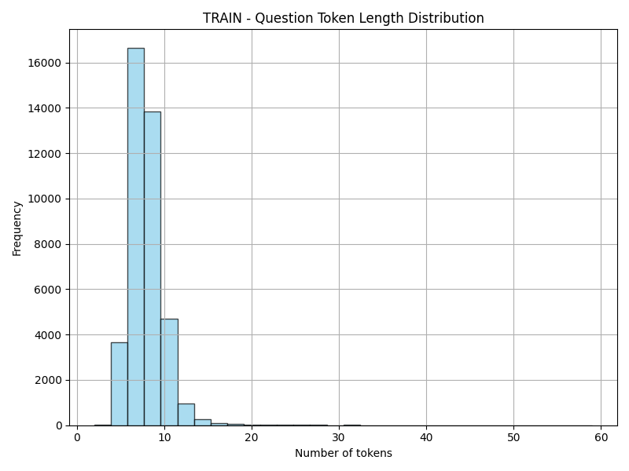
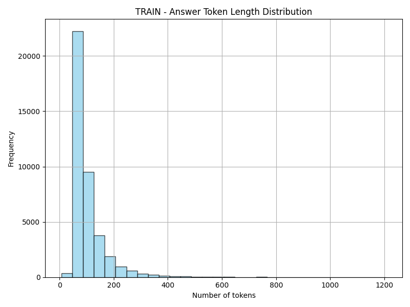
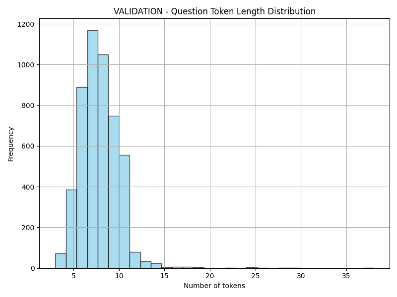
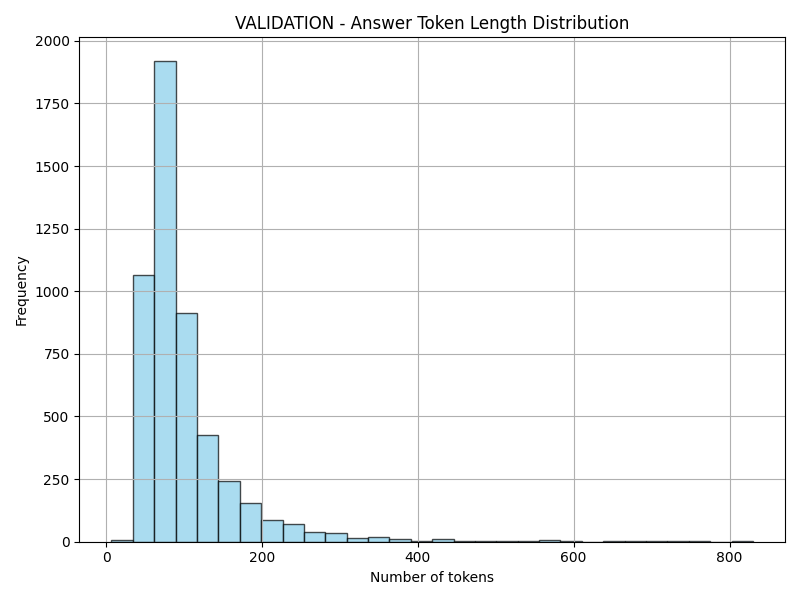
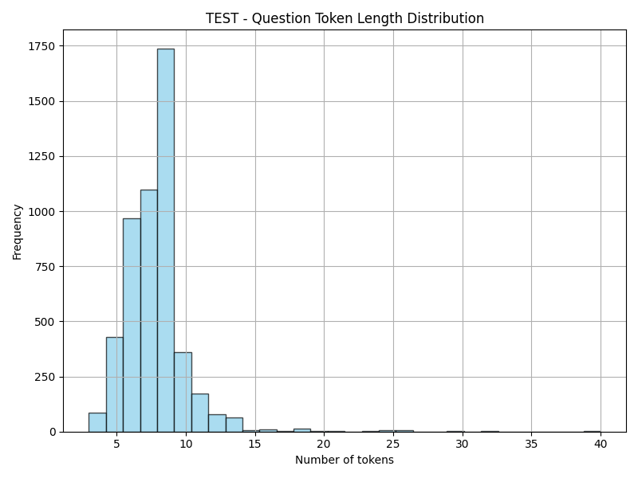
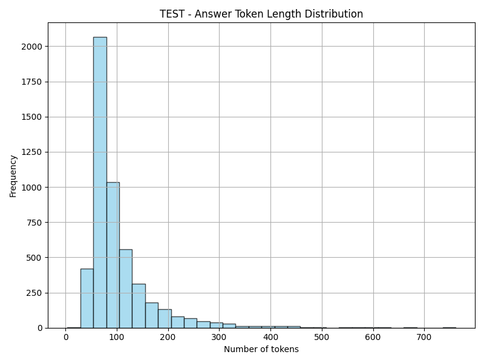

# Explanations

This section offers deeper **conceptual insights** into the **InsuranceQA-based dataset**, detailing the **rationale** behind its preparation process and **interpreting** the validation outcomes. By reading these explanations, you’ll understand **why** certain data preparation decisions were made, **what** the validation metrics reveal, and **how** the dataset can best serve your **domain-specific Gen AI projects**.

These explanations complement our [How-To Guides](how-to-guides.md) by clarifying the **underlying logic** that informs each step of data preparation and validation—without altering the original content that provides the comprehensive context and technical details of this dataset.

---

## Dataset Documentation: Domain-Specific Data for Adapting Gen AI Components in Insurance

### 1. Overview

This document details how a **domain-specific insurance dataset** was prepared to adapt key components in **General AI projects** to the **insurance domain**. These components—such as **dense retrievers**, **generative models**, and **cross-encoder rerankers**—are often pretrained on **general-domain data**. As a result, they may not fully grasp industry-specific terminology and nuances without additional adaptation.

By providing **structured**, **balanced**, and **insurance-focused** question-answer data, this dataset helps overcome that gap, enabling the effective deployment of **retrieval-augmented generation (RAG)** systems and other advanced NLP solutions in real-world insurance scenarios.

#### **Source: InsuranceQA**
The dataset originates from **InsuranceQA**, a publicly available corpus explicitly designed for question-answering in the insurance domain.  
- **Reference Paper**: Feng, Minwei, et al.  
  *["Applying Deep Learning to Answer Selection: A Study and An Open Task."](https://arxiv.org/abs/1508.01585)*  
  *Empirical Methods in Natural Language Processing (EMNLP), 2015.*  
- **Original Repo**: [https://github.com/shuzi/insuranceQA](https://github.com/shuzi/insuranceQA)

Our modifications primarily restructure the original data to ensure compatibility with **modern NLP frameworks** and **domain adaptation** use cases in insurance.

### 2. Data Preparation Context

We used a **systematic pipeline** to extract, clean, and standardize insurance-related questions and answers. Major considerations included:

- **Data Consistency**: Removing duplicates and normalizing text formats.  
- **Data Balance**: Ensuring an even distribution of relevant vs. irrelevant examples.  
- **Format Standardization**: Converting data into **structured splits** (training, validation, test) for easy integration into any standard ML workflow.

These steps aim to maximize **usability** for fine-tuning or in-context learning within **insurance AI** applications.

#### **Key Enhancements**
- **Standardized Structure**: Unified formats (e.g., CSV, JSON) for interoperability.  
- **Balanced Distribution**: Controlled number of positive and negative examples.  
- **Domain-Specific Focus**: Only contains **insurance-relevant** content for high domain accuracy.

### 3. Possible Use Cases

#### **1. Fine-Tuning Adapters for Dense Retrievers or Generative Models**
In **RAG-based Q&A systems**, a **dense retriever** locates relevant passages from an extensive corpus, while a **generative model** (e.g., an LLM) produces final answers.  
- **Why Adaptation is Needed**: General-domain retrievers and LLMs may overlook specialized insurance terminology or interpret it incorrectly.  
- **Benefit**: By fine-tuning on this dataset, you ensure better alignment with **insurance-specific vocabulary** and context.

#### **2. Fine-Tuning Cross-Encoding Reranker Models**
After the dense retriever fetches top documents, a **cross-encoder reranker** can re-evaluate those documents for more precise ranking.  
- **Why It Helps**: Off-the-shelf cross-encoders often fail to rank domain-specific content accurately.  
- **Benefit**: Rerankers adapted to insurance data can significantly boost accuracy in **insurance Q&A** pipelines.

#### **3. Synthetic Data Generation**
Tools like **Microsoft PromptWizard** can leverage this domain-specific dataset to automatically create additional insurance-related examples, further improving model robustness.  
- **Why Synthetic Data**: Real domain data is sometimes limited; synthetic augmentation can enlarge your dataset without needing massive manual curation.  
- **Benefit**: Produces **LLM-based automatic annotations**, enhancing diversity and coverage of domain-specific expressions.

---

## Technical Report 2: Data Preparation Process for the InsuranceQA Dataset

### 1. Overview of the InsuranceQA Resources

#### 1.1. The Original InsuranceQA Repository and Paper

- **Original Repository:**  
  The primary source of the dataset is the [insuranceQA](https://github.com/shuzi/insuranceQA) repository. This repository contains the raw InsuranceQA corpus that was created by collecting questions and answers from the insurance domain.  
- **The Associated Paper:**  
  The dataset and its experimental setup are described in the paper:  
  **"[Applying Deep Learning to Answer Selection: A Study and An Open Task](https://arxiv.org/abs/1508.01585)"**  
  by Minwei Feng, Bing Xiang, Michael R. Glass, Lidan Wang, and Bowen Zhou (ASRU 2015).  
  This paper outlines the deep learning architectures used for answer selection, presents baseline systems, and details experimental results. It provides the rationale behind using this dataset for various QA tasks.

#### 1.2. The `insurance_qa_python` Repository

- **Purpose:**  
  The `insurance_qa_python` repository is a pre-processed version of the original dataset. It converts the raw text data into Python-friendly formats using the pickle module.
- **Key Files:**
  - **vocabulary:**  
    A pickled Python dictionary mapping integer word indices to their corresponding word strings.
  - **answers:**  
    A pickled dictionary where each key is an answer index and the associated value is a list of word indices representing the answer text.
  - **train:**  
    A list of dictionaries; each dictionary represents a QA entry. For the training set, the key `"answers"` is used to indicate the ground-truth (relevant) answers.
  - **dev, test1, test2:**  
    Each of these is a list of dictionaries representing QA entries. They typically contain keys like `"question"`, `"good"`, and `"bad"`, where:
    - `"question"` is a list of word indices for the question.
    - `"good"` contains indices for the ground-truth (relevant) answers.
    - `"bad"` contains indices for negative (irrelevant) answers.

### 2. The Data Preparation Process

The primary goal of the data preparation process is to convert the pickled data into a balanced, stratified dataset of triads in the format `[question, answer, label]` that can be used to fine-tune the DeepSeek-R1-Distill-Qwen-14B model for binary classification (i.e., relevant vs. irrelevant).

#### 2.1. Overview of the Workflow

1. **Loading the Data:**  
   The process starts by loading the pickled files (`vocabulary`, `answers`, and the QA splits such as `train`, `dev`, `test1`, and `test2`).

2. **Translation of Tokenized Data:**  
   The numerical tokens for questions and answers are translated back into text using the vocabulary. This produces human-readable strings that represent the original questions and answers.

3. **Triad Generation:**  
   - For QA entries that contain `"good"` and `"bad"` keys (typical in `dev`, `test1`, and `test2`), the script creates examples where:
     - Answers in `"good"` are assigned a label of **1** (relevant).
     - Answers in `"bad"` are assigned a label of **0** (irrelevant).
   - For the training split (which contains only `"answers"`), the script generates positive examples from the provided answers. Negative examples are then created by randomly sampling from the global answer pool (excluding the positive answers).

4. **Global Balancing:**  
   The script ensures that the overall dataset is balanced by randomly sampling an equal number of positive and negative examples.

5. **Stratified Splitting:**  
   After global balancing, the positive and negative examples are split separately into training, validation, and test sets. This stratified split guarantees that each split is perfectly balanced (i.e., an equal number of relevant and irrelevant examples).

6. **Output Generation:**  
   The final balanced splits are saved as CSV files (`train.csv`, `validation.csv`, and `test.csv`) in a dedicated output directory.

#### 2.2. Detailed Steps and Inputs/Outputs of `data_preparation_stratified.py`

##### **Input Files:**

- **Pickled Data Files:**
  - `vocabulary`: Python dictionary mapping word indices to words.
  - `answers`: Dictionary mapping answer indices to lists of word indices.
  - QA splits: `train`, `dev`, `test1`, and `test2` (each containing lists of dictionaries representing QA entries).

##### **Processing Steps:**

1. **Loading Data:**  
   - The script loads each file using a helper function (`get_pickle`) that reads the pickled objects.
   - The vocabulary and answers files are essential to convert numerical tokens back into text.

2. **Translation and Triad Creation:**  
   - The function `translate_sent` converts a list of tokens into a readable sentence.
   - For each QA entry:
     - If the keys `"good"` and `"bad"` are present, it creates positive examples (label 1) from `"good"` and negative examples (label 0) from `"bad"`.
     - For the training split, where the key `"answers"` is present, positive examples are generated from `"answers"`, and negative examples are sampled from the overall answer pool (ensuring they do not belong to the positives).

3. **Global Balancing:**  
   - The script counts the number of positive and negative examples.
   - It then downsamples the majority class (if necessary) to obtain a balanced set where both classes have an equal number of examples.

4. **Stratified Splitting:**  
   - The balanced positives and negatives are split independently into three subsets:
     - **Train (80%)**
     - **Validation (10%)**
     - **Test (10%)**
   - The splits are then combined and shuffled to produce three perfectly balanced CSV files.

##### **Outputs:**

- **CSV Files:**
  - `train.csv`
  - `validation.csv`
  - `test.csv`
- Each CSV file contains rows in the format:
  - **question:** The human-readable text of the question.
  - **answer:** The corresponding human-readable text of the answer.
  - **label:** An integer (1 for relevant, 0 for irrelevant).

### 3. Summary

This data preparation process leverages the pre-processed InsuranceQA data from the `insurance_qa_python` repository to create a balanced, stratified dataset for fine-tuning a binary classification model. By converting tokenized questions and answers into text, generating triads, ensuring class balance, and performing a stratified split, the `data_preparation_stratified.py` script produces high-quality CSV files that serve as the input for subsequent model fine-tuning and synthetic data generation workflows.

---

## Technical Report 3: Detailed Data Validation Process and Analysis

### 1. Overview

This report presents an in-depth analysis of the prepared QA dataset using the outputs from the `data_validation.py` script. The validation process was designed to assess data quality by calculating statistical metrics, checking class balance, identifying repeated questions, and visualizing token length distributions. The insights gained here are crucial for understanding dataset characteristics before fine-tuning the DeepSeek-R1-Distill-Qwen-14B model.

### 2. Validation Methodology

#### 2.1 Data Loading
- **Files Analyzed:**  
  - `train.csv`
  - `validation.csv`
  - `test.csv`  
- **Data Structure:**  
  Each CSV file contains three columns: `question`, `answer`, and `label` (where 1 indicates a relevant answer and 0 an irrelevant one).

#### 2.2 Tokenization and Metrics Calculation
- **Tokenizer Used:**  
  A BERT-like tokenizer (`bert-base-uncased`) was used to compute token counts.  
- **Metrics Computed:**  
  - **Token Length Statistics:** Minimum, Maximum, Mean, Median, and Standard Deviation.
  - **Quantiles:** 25th, 50th (median), and 75th percentiles.
  - **Long Sequence Check:** Percentage of answers that exceed 512 tokens.
- **Additional Checks:**  
  - **Label Balance:** Count of relevant vs. irrelevant examples.
  - **Question Repetition:** Number of unique questions versus total questions.

### 3. Detailed Output and Interpretation

#### 3.1 Train Split

- **Total Examples:** 40,324  
- **Label Distribution:**  
  - **Relevant (Label 1):** 20,162  
  - **Irrelevant (Label 0):** 20,162  
  - **Balance:** Perfectly balanced.
- **Question Uniqueness:**  
  - **Unique Questions:** 14,797  
  - **Repeated Questions:** 25,527  
  - *Interpretation:* Multiple answers per question are expected in QA datasets.
- **Question Token Statistics:**  
  - **Min:** 2 tokens  
  - **Max:** 59 tokens  
  - **Mean:** 7.75 tokens  
  - **Median:** 7 tokens  
  - **Std. Dev.:** 2.22  
  - **Quantiles:**  
    - 25th Percentile: 6 tokens  
    - 50th Percentile (Median): 7 tokens  
    - 75th Percentile: 9 tokens  
  - *Interpretation:* Questions are generally short and concise, as expected.
- **Answer Token Statistics:**  
  - **Min:** 4 tokens  
  - **Max:** 1,102 tokens  
  - **Mean:** 102.22 tokens  
  - **Median:** 80 tokens  
  - **Std. Dev.:** 67.67  
  - **Quantiles:**  
    - 25th Percentile: 63 tokens  
    - 50th Percentile (Median): 80 tokens  
    - 75th Percentile: 114 tokens  
  - *Interpretation:* Most answers fall in a moderate range, though a few outliers extend into long sequences.
- **Long Sequence Check:**  
  - **Percentage of Answers >512 Tokens:** 0.37%  
  - *Interpretation:* Only a small fraction of answers exceed the 512-token threshold. Given that DeepSeek-R1-Distill-Qwen-14B supports extended context (up to ~8K tokens), this is not a significant concern.
- **Visualizations:**  
  - **Question Token Distribution Plot:**  
    
  - **Answer Token Distribution Plot:**  
    

#### 3.2 Validation Split

- **Total Examples:** 5,040  
- **Label Distribution:**  
  - **Relevant:** 2,520  
  - **Irrelevant:** 2,520  
  - **Balance:** Perfectly balanced.
- **Question Uniqueness:**  
  - **Unique Questions:** 4,042  
  - **Repeated Questions:** 998  
- **Question Token Statistics:**  
  - **Min:** 3 tokens  
  - **Max:** 46 tokens  
  - **Mean:** 7.73 tokens  
  - **Median:** 7 tokens  
  - **Std. Dev.:** 2.25  
  - **Quantiles:**  
    - 25th Percentile: 6 tokens  
    - 50th Percentile: 7 tokens  
    - 75th Percentile: 9 tokens
- **Answer Token Statistics:**  
  - **Min:** 7 tokens  
  - **Max:** 830 tokens  
  - **Mean:** 102.51 tokens  
  - **Median:** 82 tokens  
  - **Std. Dev.:** 66.24  
  - **Quantiles:**  
    - 25th Percentile: 64 tokens  
    - 50th Percentile: 82 tokens  
    - 75th Percentile: 115 tokens
- **Long Sequence Check:**  
  - **Percentage of Answers >512 Tokens:** 0.34%
- **Visualizations:**  
  - **Question Token Distribution Plot:**  
    
  - **Answer Token Distribution Plot:**  
    

#### 3.3 Test Split

- **Total Examples:** 5,042  
- **Label Distribution:**  
  - **Relevant:** 2,521  
  - **Irrelevant:** 2,521  
  - **Balance:** Perfectly balanced.
- **Question Uniqueness:**  
  - **Unique Questions:** 4,033  
  - **Repeated Questions:** 1,009  
- **Question Token Statistics:**  
  - **Min:** 3 tokens  
  - **Max:** 40 tokens  
  - **Mean:** 7.78 tokens  
  - **Median:** 7 tokens  
  - **Std. Dev.:** 2.24  
  - **Quantiles:**  
    - 25th Percentile: 6 tokens  
    - 50th Percentile: 7 tokens  
    - 75th Percentile: 9 tokens
- **Answer Token Statistics:**  
  - **Min:** 11 tokens  
  - **Max:** 1,206 tokens  
  - **Mean:** 101.92 tokens  
  - **Median:** 81 tokens  
  - **Std. Dev.:** 68.54  
  - **Quantiles:**  
    - 25th Percentile: 64 tokens  
    - 50th Percentile: 81 tokens  
    - 75th Percentile: 115 tokens
- **Long Sequence Check:**  
  - **Percentage of Answers >512 Tokens:** 0.36%
- **Visualizations:**  
  - **Question Token Distribution Plot:**  
    
  - **Answer Token Distribution Plot:**  
    

### 4. Expert Analysis

- **Dataset Balance:**  
  Each split shows a perfect 50/50 balance between relevant and irrelevant labels. This balance is critical for unbiased model training.
  
- **Token Length Consistency:**  
  - **Questions:**  
    - The uniform distribution of question lengths (mostly between 6 and 9 tokens) indicates consistency and aligns with typical real-world queries.
  - **Answers:**  
    - Although the majority of answers are within a moderate token range (mostly under 200 tokens), the existence of a small percentage of very long answers is noted. Given the capability of DeepSeek-R1-Distill-Qwen-14B to process extended sequences, this is acceptable. However, practitioners should monitor GPU memory and training efficiency when processing these outliers.
  
- **Repetition of Questions:**  
  - The high number of repeated questions (especially in the train split) is expected in QA datasets and does not inherently compromise model performance. If desired, further analysis can be performed to examine if duplicate handling or grouping could enhance training, but for the purposes of our binary classification task, retention is appropriate.
  
- **Visual Insights:**  
  - The histograms provide a clear visual representation of token distributions. These plots are valuable for detecting anomalies, such as unexpected peaks or outliers, and for informing any potential preprocessing adjustments (e.g., if extreme outliers needed special handling).

### 5. Conclusion

The detailed validation process confirms:
- **Balanced Splits:** All splits are perfectly balanced.
- **Consistent Token Distributions:** Question lengths are uniformly short, while answer lengths show a moderate range with a small fraction of longer outliers.
- **Low Incidence of Excessively Long Answers:** Only ~0.3–0.4% of answers exceed 512 tokens, which is acceptable for our model given its extended context capabilities.
- **Data Quality:** The overall dataset quality is robust and suitable for fine-tuning the DeepSeek-R1-Distill-Qwen-14B model on binary classification tasks in our domain-specific RAG Q&A system.

The results from this validation process provide a strong foundation for subsequent model fine-tuning and synthetic data generation. 

---